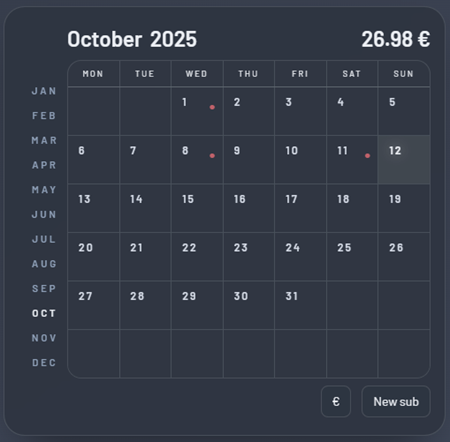

# Amuzing Subscriptions Calendar

   

Subscriptionss Calendar is a lightweight web app for tracking and visualizing recurring subscriptions on a monthly calendar. It highlights upcoming renewal dates and aims to provide quick add/edit/delete flows. I made it for my own use with help of Windsurf. It is pretty plain and simple, but it does the job.

## Features

- Monthly calendar with highlighted subscription days.
- Quick add/edit/delete in a modal dialog with a built-in date picker and autocomplete.
- Recurring series: create monthly series, convert a single entry to a series, or delete a full series.
- Multi-currency support with symbols and a per-month total summary.

## Το-Do

- Probably add actual icons instead of using dots.

## Credits

- Header icon by [Icons8](https://icons8.com/)
- Windsurf
