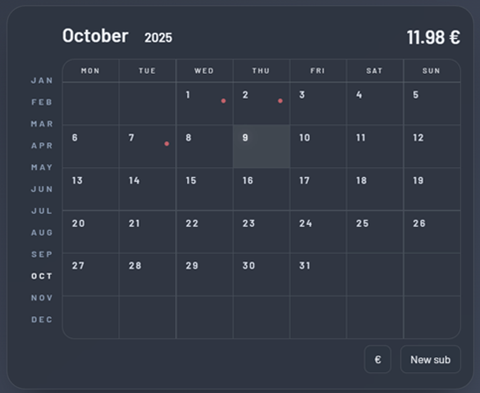

# Amuzing Subscriptions Calendar

   

Subscriptionss Calendar is a lightweight web app for tracking and visualizing recurring subscriptions on a monthly calendar. It highlights upcoming renewal dates and aims to provide quick add/edit/delete flows.

## Features

- Monthly calendar with marked subscription dates; click a day to view items
- Create, edit, and delete subscriptions in a modal dialog
- Built-in date picker (week starts on Monday)
- Simple Express API with file-backed storage for persistence

## Το-Do

- Add actual icons instead of dots
- Extend subscription items with more services
- Add fancy animations using Motion library.
